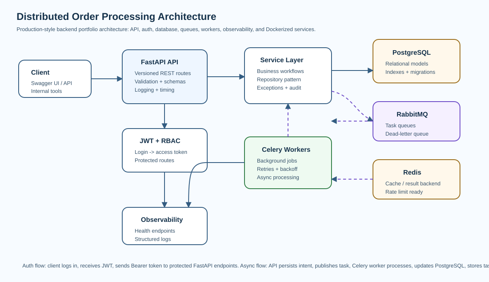

# Distributed Order Processing System


Production-style FastAPI backend for an event-driven e-commerce/logistics order platform. It demonstrates order intake, inventory reservation, payment orchestration, shipment lifecycle handling, retry/failure recovery, and observability across queues and workers.

This is a recruiter-facing distributed backend portfolio project. It shows how API, database, queue, worker, and operational components fit together in a realistic order processing workflow.



---

## Business Problem

Order platforms coordinate multiple workflows that can fail independently: inventory may be unavailable, payment may fail, shipment creation may be delayed, and duplicate requests must be handled safely. This backend simulates those concerns with idempotent APIs, event-driven workflow steps, compensation logic, and persistent auditability.

## Architecture Overview

- **Client / partner API** creates orders with an idempotency key.
- **FastAPI API** authenticates users, validates requests, persists order records, and publishes events.
- **JWT + RBAC** supports customer, vendor, and admin role behavior.
- **PostgreSQL** stores users, orders, inventory, warehouses, payments, shipments, events, audit logs, and failed jobs.
- **RabbitMQ** routes workflow events to order, inventory, payment, shipment, and dead-letter queues.
- **Celery workers** execute inventory reservation, payment simulation, shipment creation, retries, and compensation workflows.
- **Redis** stores Celery results and supports cache/readiness patterns.
- **Docker Compose** runs API, worker, scheduler, PostgreSQL, Redis, and RabbitMQ.

## Key Features

- JWT authentication and RBAC roles: customer, vendor, admin
- idempotent order creation via `Idempotency-Key`
- order history and lifecycle status tracking
- inventory reservation, stock deduction, and release on failure
- payment initiation, success/failure simulation, retry, and compensation workflows
- shipment creation, shipment events, tracking status, and delayed shipment hooks
- RabbitMQ queues, Celery workers, scheduled jobs, retries, and dead-letter handling
- audit logs and failed job persistence
- structured JSON logging, request timing, health checks, metrics, and worker monitoring endpoints
- Docker Compose stack and pytest tests for API/worker flows

## Technology Stack

| Area | Tools |
|---|---|
| API | Python 3.12, FastAPI, Pydantic |
| Database | PostgreSQL, SQLAlchemy ORM, Alembic |
| Async Processing | RabbitMQ, Celery workers, scheduled jobs |
| Cache / Results | Redis |
| Auth | JWT access tokens, password hashing, RBAC |
| DevOps | Docker, Docker Compose, Makefile, GitHub Actions |
| Quality | Pytest, API tests, worker flow tests, structured logging |

## Project Structure

```text
app/
  api/              FastAPI routers and route dependencies
  auth/             JWT security and protected-route helpers
  core/             config, logging, exceptions
  db/               SQLAlchemy session and metadata
  events/           event contracts and publisher helpers
  middleware/       request context and timing
  models/           order, inventory, payment, shipment, audit entities
  observability/    health and metrics helpers
  repositories/     database access layer
  schemas/          Pydantic request/response contracts
  services/         order, inventory, payment, shipping orchestration
  workers/          Celery app and task definitions
  tests/            pytest API and worker-flow tests
scripts/            demo data seeding
alembic/            migration history
```

## API Documentation

Swagger UI:

```text
http://127.0.0.1:8000/docs
```

OpenAPI JSON:

```text
http://127.0.0.1:8000/openapi.json
```

### Authentication Example

```bash
curl -X POST http://localhost:8000/api/v1/auth/signup \
  -H "Content-Type: application/json" \
  -d '{"email":"customer@orders.local","password":"CustomerPass123","full_name":"Demo Customer"}'
```

Use the returned token:

```http
Authorization: Bearer <access_token>
```

### Create Order Request

```bash
curl -X POST http://localhost:8000/api/v1/orders \
  -H "Authorization: Bearer $TOKEN" \
  -H "Idempotency-Key: order-2026-0001" \
  -H "Content-Type: application/json" \
  -d '{"currency":"USD","items":[{"sku":"SKU-HEADPHONES","quantity":2}]}'
```

### Example Response

```json
{
  "status": "accepted",
  "order_status": "pending",
  "message": "Order accepted for async processing"
}
```

Operational endpoints:

```bash
curl http://localhost:8000/api/v1/system/health
curl http://localhost:8000/api/v1/system/metrics
curl http://localhost:8000/api/v1/system/workers
```

## Distributed Workflow

1. Client submits order with `Idempotency-Key`.
2. API validates user, request body, and duplicate key behavior.
3. Order and audit records are persisted.
4. `order.created` event is published to RabbitMQ.
5. Worker reserves inventory.
6. Payment simulation authorizes or fails payment.
7. Shipment workflow creates tracking records.
8. Failures trigger retry or compensation such as inventory release.
9. Failed jobs are persisted and dead-lettered for diagnostics.

## Database Design Overview

Primary entities:

- `users`: authenticated platform actors with role assignments
- `orders`: order aggregate, idempotency key, and lifecycle state
- `order_items`: line items and SKU quantities
- `warehouses`: warehouse simulation data
- `inventory`: stock, reserved quantity, and low-stock state
- `payments`: payment transaction state and provider simulation result
- `shipments`: tracking number, carrier, and fulfillment status
- `shipment_events`: timestamped shipment lifecycle updates
- `audit_logs`: traceable workflow and correction events
- `failed_jobs`: exhausted retry/dead-letter diagnostics

Database practices shown:

- UUID primary keys
- foreign key relationships across order, payment, shipment, inventory, and audit records
- indexes for idempotency key, order status, SKU, shipment tracking, and time-based lookups
- Alembic migration in `alembic/versions`

## Docker Setup

```bash
cp .env.example .env
docker compose up --build
```

Services:

| Container | Purpose |
|---|---|
| `api` | FastAPI application |
| `worker` | Celery workers for order/inventory/payment/shipment queues |
| `scheduler` | Celery Beat scheduled jobs |
| `postgres` | PostgreSQL database |
| `redis` | Celery result backend |
| `rabbitmq` | broker and management UI |

Initialize demo data:

```bash
docker compose exec api alembic upgrade head
docker compose exec api python scripts/seed_demo.py
```

RabbitMQ management UI:

```text
http://localhost:15672
guest / guest
```

## Local Development

```bash
python -m venv .venv
source .venv/bin/activate
make install
make migrate
make seed
make run
```

Run worker locally:

```bash
make worker
```

## Testing

```bash
make test
```

Test coverage includes:

- authentication and order API behavior
- health endpoint behavior
- worker flow simulation
- inventory/payment/shipment orchestration paths

## Environment Variables

See [`.env.example`](.env.example). Important values:

- `DATABASE_URL`
- `TEST_DATABASE_URL`
- `REDIS_URL`
- `CELERY_BROKER_URL`
- `CELERY_RESULT_BACKEND`
- `SECRET_KEY`
- `IDEMPOTENCY_TTL_SECONDS`

## Recruiter Review

A concise hiring-manager style review is available here: [`docs/recruiter-review.md`](docs/recruiter-review.md).

## Future Enhancements

- transactional outbox for stronger event publication guarantees
- split inventory/payment/shipping into independent services
- payment gateway adapter layer
- OpenTelemetry traces across API and workers
- warehouse allocation optimization
- Kafka event stream for analytics fan-out
- admin DLQ replay and compensation dashboard

## Recruiter-Facing Summary

This project demonstrates backend and platform engineering signals recruiters can verify quickly: FastAPI APIs, PostgreSQL modeling, SQLAlchemy/Alembic, JWT/RBAC, RabbitMQ/Celery workflows, Redis, idempotency, compensation logic, Docker Compose, tests, metrics, and worker monitoring. It is the strongest repository to review first for Python Backend Engineer, Backend API Engineer, and Platform Engineer roles.
