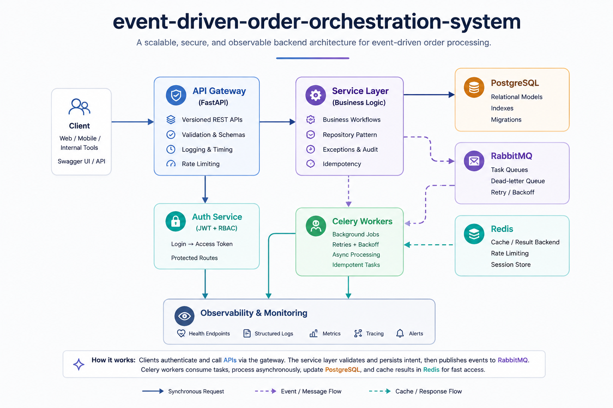

# Event-Driven Order Orchestration System


A production-style, event-driven backend that simulates how real e-commerce and logistics platforms process orders — where placing an order isn't one action, but a chain of independent steps (inventory, payment, shipping) that each need to succeed, fail, retry, or roll back on their own.

---

## The Problem

Most "order system" demo projects are a single `POST /orders` endpoint that writes one row to a database. That's not how order processing actually works at scale.

In a real system:

- **Inventory might be unavailable** by the time payment is attempted.
- **Payment might fail** after inventory has already been reserved.
- **A network retry or a double-click** can send the exact same order request twice — and naive systems create two orders and charge twice.
- **A background job can crash mid-task**, and if there's no retry or dead-letter handling, that order silently disappears.
- **API response time matters** — a client shouldn't have to wait 5+ seconds while inventory, payment, and shipping are processed synchronously inside one request.

These are the problems that separate a tutorial project from a system that could survive real traffic.

## The Solution

This project solves each of those problems directly, using patterns taken from real distributed backend architecture:

| Problem | How this project solves it |
|---|---|
| Duplicate order requests (retries, double-clicks) | Every order requires an `Idempotency-Key` header. The same key always returns the same order — no duplicate orders, no duplicate charges. |
| Slow, blocking order creation | The API only validates and persists the order intent, then publishes an event to RabbitMQ and returns immediately. All heavy work happens asynchronously. |
| Multi-step workflows that can partially fail | Order → inventory reservation → payment authorization → shipment creation is broken into discrete steps, each independently retryable, with compensation logic (e.g., releasing reserved inventory if payment fails). |
| Jobs that fail permanently | Failed tasks retry with backoff; if retries are exhausted, the job is moved to a dead-letter queue and persisted in a `failed_jobs` table instead of vanishing. |
| "Is the system healthy?" | Health, metrics, and worker-monitoring endpoints expose the real-time state of the API and background workers. |
| Access control | JWT-based authentication with role separation between customer, vendor, and admin. |

## How It Works (Architecture)



**Request flow:**

1. Client authenticates and receives a JWT.
2. Client sends `POST /orders` with an `Idempotency-Key`.
3. The API validates the request, checks the idempotency key, and persists the order as `pending`.
4. The API publishes an `order.created` event to RabbitMQ and immediately returns a response — the client is never blocked waiting for fulfillment.
5. A Celery worker picks up the event and executes the workflow: reserve inventory → authorize payment → create shipment.
6. Each step updates PostgreSQL and emits audit log entries.
7. If a step fails, the worker retries with backoff; if retries are exhausted, the job is dead-lettered and logged to `failed_jobs` for investigation.
8. Redis backs Celery's result store and supports fast read/cache patterns.

This decouples the **API layer** (fast, synchronous, user-facing) from the **fulfillment layer** (slow, asynchronous, failure-tolerant) — which is the core idea behind event-driven backend design.

## Demo Video
[![Watch the Demo Video Part 1]](docs/assets/part1.mp4)
[![Watch the Demo Video Part 2]](docs/assets/part2.mp4)

Note: The project demo video has been divided into two parts because GitHub does not allow large files to be committed. Therefore, the demo video is provided in two separate parts.

## 📖 Demo Explanation

For a detailed explanation of the demo and its workflow:

👉 [Read the Demo Video Explanation](docs/demo-video-explanation.md)


## Key Features

- JWT authentication and RBAC roles: customer, vendor, admin
- Idempotent order creation via `Idempotency-Key`
- Order history and lifecycle status tracking
- Inventory reservation, stock deduction, and release on failure
- Payment initiation, success/failure simulation, retry, and compensation workflows
- Shipment creation, shipment events, tracking status, and delayed shipment hooks
- RabbitMQ queues, Celery workers, scheduled jobs, retries, and dead-letter handling
- Audit logs and failed job persistence
- Structured JSON logging, request timing, health checks, metrics, and worker monitoring endpoints
- Full Docker Compose stack and pytest coverage for API/worker flows

## Technology Stack

| Area | Tools |
|---|---|
| API | Python 3.12, FastAPI, Pydantic |
| Database | PostgreSQL, SQLAlchemy ORM, Alembic |
| Async Processing | RabbitMQ, Celery workers, scheduled jobs |
| Cache / Results | Redis |
| Auth | JWT access tokens, password hashing, RBAC |
| DevOps | Docker, Docker Compose, Makefile, GitHub Actions |
| Quality | Pytest, API tests, worker flow tests, structured logging |

## Project Structure

```text
app/
  api/              FastAPI routers and route dependencies
  auth/             JWT security and protected-route helpers
  core/             config, logging, exceptions
  db/               SQLAlchemy session and metadata
  events/           event contracts and publisher helpers
  middleware/       request context and timing
  models/           order, inventory, payment, shipment, audit entities
  observability/    health and metrics helpers
  repositories/     database access layer
  schemas/          Pydantic request/response contracts
  services/         order, inventory, payment, shipping orchestration
  workers/          Celery app and task definitions
  tests/            pytest API and worker-flow tests
scripts/            demo data seeding
alembic/            migration history
docs/               architecture diagram, recruiter review
```

## API Documentation

Swagger UI:

```text
http://127.0.0.1:8000/docs
```

OpenAPI JSON:

```text
http://127.0.0.1:8000/openapi.json
```

### Authentication Example

```bash
curl -X POST http://localhost:8000/api/v1/auth/signup \
  -H "Content-Type: application/json" \
  -d '{"email":"customer@ordersapp.com","password":"CustomerPass123","full_name":"Demo Customer"}'
```

Use the returned token on subsequent requests:

```http
Authorization: Bearer <access_token>
```

### Create Order Request

```bash
curl -X POST http://localhost:8000/api/v1/orders \
  -H "Authorization: Bearer $TOKEN" \
  -H "Idempotency-Key: order-2026-0001" \
  -H "Content-Type: application/json" \
  -d '{"currency":"USD","items":[{"sku":"SKU-HEADPHONES","quantity":2}]}'
```

### Example Response

```json
{
  "id": "7bed0cac-dbc0-4137-986a-42bfada3e0bc",
  "status": "fulfillment_requested",
  "total_amount": "99.98",
  "currency": "USD",
  "payments": [{ "status": "authorized" }],
  "shipments": [{ "status": "created", "tracking_number": "ARCBFC3ECEE49DD" }]
}
```

Sending the exact same request again with the same `Idempotency-Key` returns this exact same response — no duplicate order is created.

Operational endpoints:

```bash
curl http://localhost:8000/api/v1/system/health
curl http://localhost:8000/api/v1/system/metrics
curl http://localhost:8000/api/v1/system/workers
```

## Database Design Overview

Primary entities:

- `users` — authenticated platform actors with role assignments
- `orders` — order aggregate, idempotency key, and lifecycle state
- `order_items` — line items and SKU quantities
- `warehouses` — warehouse simulation data
- `inventory` — stock, reserved quantity, and low-stock state
- `payments` — payment transaction state and provider simulation result
- `shipments` — tracking number, carrier, and fulfillment status
- `shipment_events` — timestamped shipment lifecycle updates
- `audit_logs` — traceable workflow and correction events
- `failed_jobs` — exhausted retry/dead-letter diagnostics

Database practices demonstrated:

- UUID primary keys
- Foreign key relationships across order, payment, shipment, inventory, and audit records
- Indexes for idempotency key, order status, SKU, shipment tracking, and time-based lookups
- Alembic migrations in `alembic/versions`

## Docker Setup

```bash
cp .env.example .env
docker compose up --build
```

Services:

| Container | Purpose |
|---|---|
| `api` | FastAPI application |
| `worker` | Celery workers for order/inventory/payment/shipment queues |
| `scheduler` | Celery Beat scheduled jobs |
| `postgres` | PostgreSQL database |
| `redis` | Celery result backend |
| `rabbitmq` | Broker and management UI |

Initialize the database and demo data:

```bash
docker compose exec api alembic upgrade head
docker compose exec api python -m scripts.seed_demo
```

RabbitMQ management UI:

```text
http://localhost:15672
guest / guest
```

## Local Development

```bash
python -m venv .venv
source .venv/bin/activate
make install
make migrate
make seed
make run
```

Run a worker locally:

```bash
make worker
```

## Testing

```bash
make test
```

Test coverage includes:

- Authentication and order API behavior
- Health endpoint behavior
- Worker flow simulation
- Inventory/payment/shipment orchestration paths

## Environment Variables

See [`.env.example`](.env.example). Important values:

- `DATABASE_URL`
- `TEST_DATABASE_URL`
- `REDIS_URL`
- `CELERY_BROKER_URL`
- `CELERY_RESULT_BACKEND`
- `SECRET_KEY`
- `IDEMPOTENCY_TTL_SECONDS`

## Recruiter Review

A concise hiring-manager style review is available here: [`docs/recruiter-review.md`](docs/recruiter-review.md).

## Future Enhancements

- Transactional outbox for stronger event publication guarantees
- Split inventory/payment/shipping into independent services
- Payment gateway adapter layer
- OpenTelemetry traces across API and workers
- Warehouse allocation optimization
- Kafka event stream for analytics fan-out
- Admin DLQ replay and compensation dashboard

## License

This project is licensed under the MIT License — see the [LICENSE](LICENSE) file for details.

## Author

**NOOH KHAN**
[GitHub](https://github.com/noohkhan7232)

---

This project demonstrates backend and platform engineering signals that can be verified quickly: FastAPI APIs, PostgreSQL modeling, SQLAlchemy/Alembic, JWT/RBAC, RabbitMQ/Celery workflows, Redis, idempotency, compensation logic, Docker Compose, automated tests, metrics, and worker monitoring.